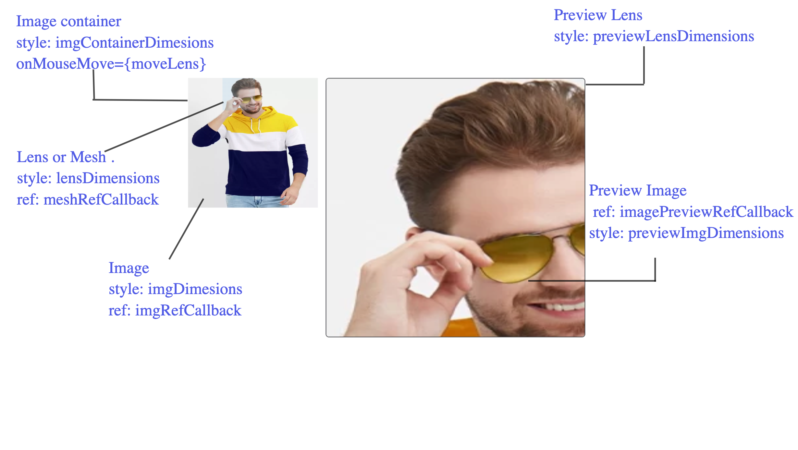
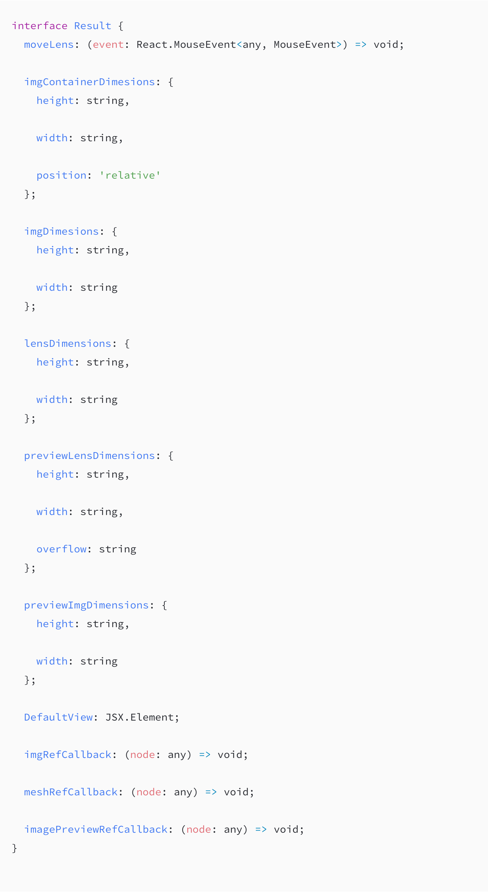

# Image zoom react hook

 [](https://badge.fury.io/js/react-image-zoom-hook)

<p align="center">
  </img>
</p>

### Installing

If using npm, Run

```javascript

npm install --save react-image-zoom-hook

```

If using yarn , Run

```javascript

yarn add react-image-zoom-hook

```

## Getting Started

```jsx
<>
  <div onMouseMove={moveLens} style={{ ...imgContainerDimesions }}>
    <div ref={meshRefCallback} style={{ ...lensDimensions }} />

    
  </div>

  <div style={{ ...previewLensDimensions }}>
    
  </div>
</>
```

Let's see the visual reperesentation of the layout described above in jsx



Following are the segregation of properties based on different element

| Element         | Attributes returned by Hook                   |
| --------------- | --------------------------------------------- |
| Image Container | moveLens, imgContainerDimesions               |
| Lens or Mesh    | lensDimensions, meshRefCallback               |
| Image           | imgDimesions, imgRefCallback                  |
| Preview Image   | imagePreviewRefCallback, previewImgDimensions |
| Preview Lens    | previewLensDimensions                         |

Customisation:

1.  It is fully customisable, as implementing component is in consumer's control.
2.  Any custom styling can be applied to all the elements mentioned in above table.

## Default Zoom

```jsx
/**

* Example of default view

*/
import React from "react";
import useImageZoom from "react-image-zoom-hook";

function DefaultZoomApp() {
  /**

* Necessary inputs for useImageZoomHook

*/

  /**

* The ratio of lens height and width on main image and the zoom image also

* should remain same for correct working.

*/

  const imgHeight = 600;

  const imgWidth = 500;

  const lensHeight = 100;

  const lensWidth = 100;

  const previewLensHeight = 600;

  const img =
    "https://rukminim1.flixcart.com/image/880/1056/jw6pifk0/t-shirt/e/v/z/m-61ywn-lewel-original-imafgxd7dfg7uub2.jpeg?q=50";

  const previewImg =
    "https://rukminim1.flixcart.com/image/880/1056/jw6pifk0/t-shirt/e/v/z/m-61ywn-lewel-original-imafgxd7dfg7uub2.jpeg?q=90";

  const { DefaultView } = useImageZoom({
    imgHeight,

    imgWidth,

    lensHeight,

    lensWidth,

    previewLensHeight,

    img,

    previewImg
  });

  /**

* Two images are involved here, user need to have a actual image and

* one good quality image with higher resolution

*/

  return <div className="container">{DefaultView}</div>;
}
```

## Customised Zoom

```jsx
/**

 * Example of customised zooming

*/
import React from "react";
import useImageZoom from "react-image-zoom-hook";

function AppWithZoomCustomization() {
  /**

* Necessary inputs for useImageZoomHook

*/

  /**

* The ratio of lens height and width on main image and the zoom image also

* should remain same for correct working.

*/

  const imgHeight = 600;

  const imgWidth = 500;

  const lensHeight = 100;

  const lensWidth = 100;

  const previewLensHeight = 600;

  const img =
    "https://rukminim1.flixcart.com/image/880/1056/jw6pifk0/t-shirt/e/v/z/m-61ywn-lewel-original-imafgxd7dfg7uub2.jpeg?q=50";

  const previewImg =
    "https://rukminim1.flixcart.com/image/880/1056/jw6pifk0/t-shirt/e/v/z/m-61ywn-lewel-original-imafgxd7dfg7uub2.jpeg?q=90";

  const {
    moveLens,

    imgDimesions,

    lensDimensions,

    previewLensDimensions,

    previewImgDimensions,

    imgContainerDimesions,

    imgRefCallback,

    meshRefCallback,

    imagePreviewRefCallback
  } = useImageZoom({
    imgHeight,

    imgWidth,

    lensHeight,

    lensWidth,

    previewLensHeight,

    img,

    previewImg
  });

  /**

* Two images are involved here, user need to have a actual image and

* one good quality image with higher resolution

*/

  return (
    <div className="container">
      <div
        className="img-main-container"
        onMouseMove={moveLens}
        style={{
          ...imgContainerDimesions
        }}
      >
        <div
          ref={meshRefCallback}
          className="mesh"
          style={{
            ...lensDimensions
          }}
        />

        
      </div>

      <div
        className="img-preview-section-container"
        // ref={imagePreviewRefContainer}

        style={{
          ...previewLensDimensions
        }}
      >
        
      </div>
    </div>
  );
}

/**

* Try to use both the types of image zoom

* DefaultZoomApp : where you get the default zoom UI and also customizable

* AppWithZoomCustomization: where user want to take control of different ui elements

*/

ReactDOM.render(<AppWithZoomCustomization />, document.getElementById("root"));
```

Type interface



[Gist for types above](https://gist.github.com/simbathesailor/66e1a8db597703f2a34868998c3d9f91)

## Running the tests

```javascript

yarn run test

```

## Contributing

Please read [CONTRIBUTING.md](CONTRIBUTING.md) for details on our code of conduct, and the process for submitting pull requests to us.

## Versioning

We use [SemVer](http://semver.org/) for versioning. For the versions available, see the [tags on this repository](https://github.com/your/project/tags).

## Authors

**simbathesailor**[PurpleBooth](https://github.com/simbathesailor)

See also the list of [contributors](https://github.com/your/project/contributors) who participated in this project.

### Links

[Example customized zoom](https://codesandbox.io/s/young-snow-vbonz)

## License

This project is licensed under the MIT License - see the [LICENSE.md](LICENSE.md) file for details

## Contributors

Thanks goes to these wonderful people ([emoji key](https://github.com/all-contributors/all-contributors#emoji-key)):

<table><tr><td  align="center"><a  href="https://github.com/simbathesailor"><br /><sub><b>Anil kumar Chaudhary</b></sub></a><br /><a  href="https://github.com/simbathesailor/react-image-zoom-hook/commits?author=simbathesailor"  title="Code">💻</a>  <a  href="#ideas-simbathesailor"  title="Ideas, Planning, & Feedback">🤔</a>  <a  href="#design-simbathesailor"  title="Design">🎨</a>  <a  href="https://github.com/simbathesailor/react-image-zoom-hook/commits?author=simbathesailor"  title="Documentation">📖</a>  <a  href="https://github.com/simbathesailor/react-image-zoom-hook/issues/created_by/simbathesailor"  title="Bug reports">🐛</a></td></tr></table>
